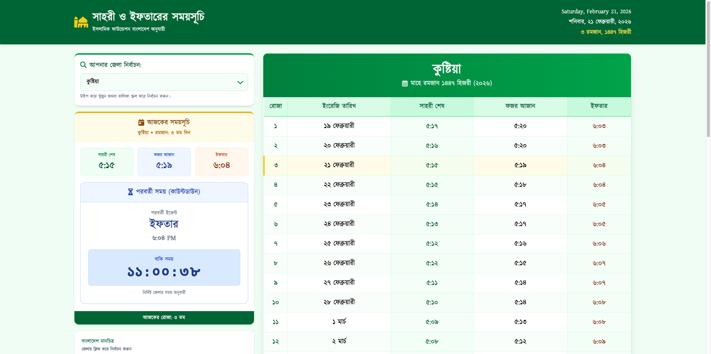
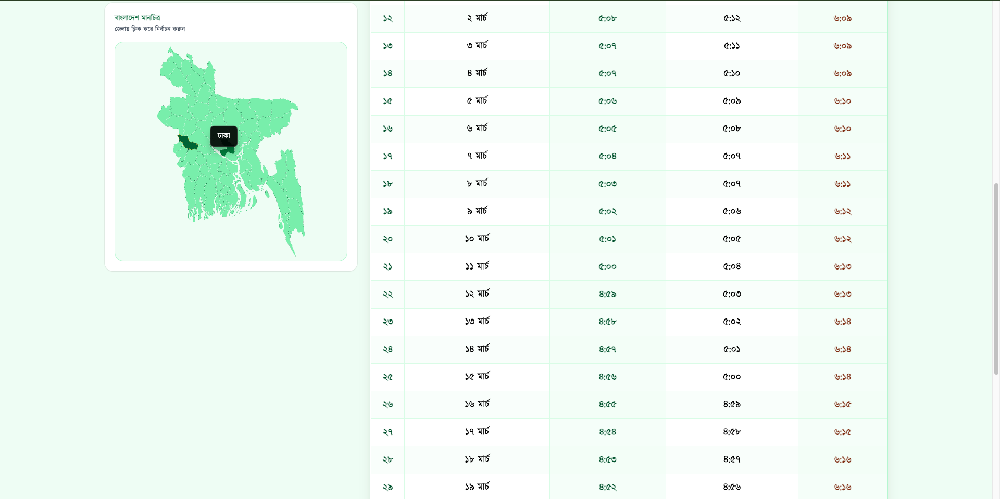
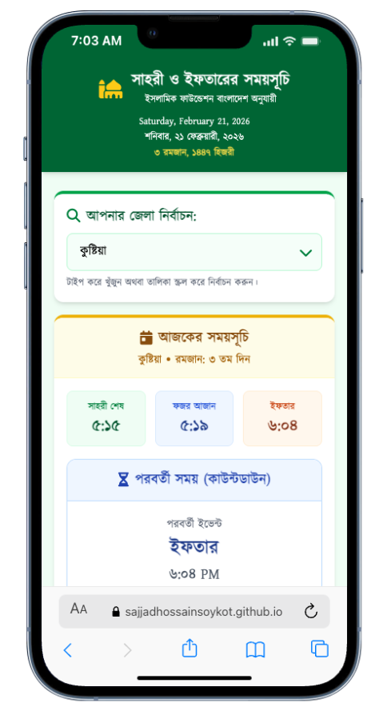
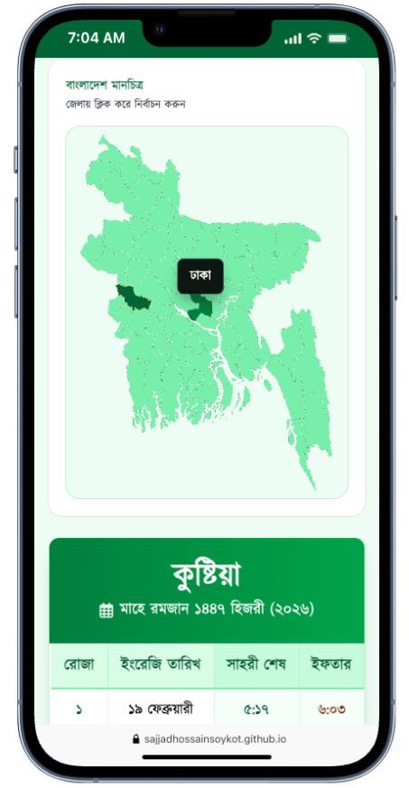
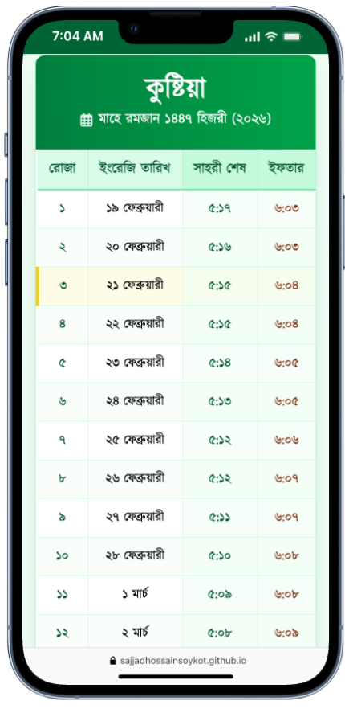

<H1 align="center"> 🌙 Ramadan Calendar 2026 – Bangladesh</H1>

  <b>A Modern District-Based Ramadan Timetable Web App</b> 
  Built with React • Vite • Tailwind CSS • PWA

    <a href="https://sajjadhossainsoykot.github.io/ramadan_calender/"><b>Live Demo</b></a> 
  🔗 <a href="https://sajjadhossainsoykot.github.io/ramadan_calender/"><b>https://sajjadhossainsoykot.github.io/ramadan_calender</b></a>

---

## ✨ Overview

Ramadan Calendar 2026 is a beautifully designed, responsive web application that provides accurate Sehri and Iftar timings for all districts of Bangladesh.  
This web application follows the Time Schedule of Islamic Foundation Bangladesh.   
It combines clean UI design, smart search functionality, real-time countdown logic, and Progressive Web App capabilities to deliver a smooth and modern Ramadan experience.

---

## 🎯 Core Features

### 🗺 District-Based Timetable
- Select any district in Bangladesh
- Smart searchable dropdown
- Interactive Bangladesh SVG map
- Instant timetable update on district change

### 🔍 Smart Search System
- Type-to-search district names
- Scrollable dropdown results
- Case-insensitive matching
- Keyboard accessible
- Mobile-friendly interaction
- Clean UI with smooth focus states

### 📅 Complete Ramadan Schedule
- Full 30-day Ramadan timetable
- Sehri & Iftar times clearly displayed
- Highlighted current day
- Clean tabular layout for readability

### ⏳ Live Countdown System
- Automatically detects the next event:
  - Sehri
  - Iftar
- Real-time countdown timer
- Updates every second
- Smooth dynamic UI update

### 🌙 Islamic & Bangla Date Integration
- Hijri date display
- Bangla formatted dates
- Clean header layout with calendar information

### 📱 Fully Responsive Design
Optimized for:
- Mobile devices
- Tablets
- Laptops
- Desktop screens

Modern spacing, readable typography, and smooth layout structure.

### 🚀 Progressive Web App (PWA)
- Installable on mobile devices
- Service worker support
- Offline capability
- Web App Manifest configured
- App-like experience on mobile

---

## 🎨 UI/UX Design Highlights

- Soft green Ramadan-themed color palette
- Card-based layout
- Elegant rounded components
- Accessible contrast and readability
- Smooth hover and focus effects
- Clean typography hierarchy

---

## 🛠 Tech Stack

- React
- Vite
- Tailwind CSS
- Headless UI
- JavaScript (ES6+)
- Progressive Web App (PWA)
- GitHub Pages Deployment

---

## 🖼 Screenshots

## 🖥 Desktop Preview

  

  

---

## 📱 Mobile Preview

  
  
  

---

## 🌐 Live Application

https://sajjadhossainsoykot.github.io/ramadan_calender/

---

## 🚀 Future Improvements

- Dark Mode Toggle
- Push Notification Reminder
- Automatic Location Detection
- Multi-language Support
- API-based dynamic prayer times
- Ramadan Special Events Integration

---

## 👨‍💻 Developers

<i>Feature Enhancements and Developer:</i>  
<b>Sajjad Hossain Soykot</b> 
  <a href="https://github.com/SajjadHossainSoykot">@SajjadHossainSoykot</a>

<i>Designer and Intial Version:</i> 
<b>Kazi Tuhin</b> 
  <a href="https://github.com/kazimmt">@kazimmt</a>

---

## ⭐ Support

If you like this project, consider giving it a ⭐ on GitHub!
